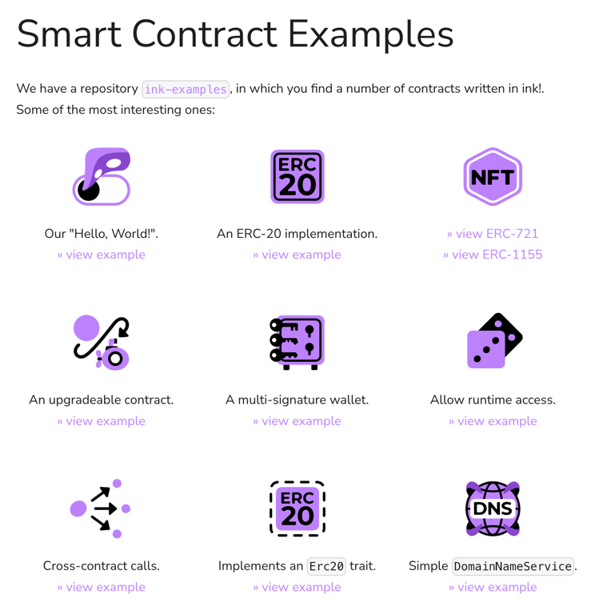

# Bounty: ink! Documentation Website Upgrade

### Objective

The current ink! documentation website (https://use.ink/) is an extensive developer documentation. We want to move this content under `use.ink/docs` and have an engaging website in its place that provides a less overwhelming entry point to ink!.

The website should:
- Give a clear understanding of what ink! is and what its strengths are.
- Explain how it fits into the Polkadot ecosystem.
- Make further content easily discoverable (tutorials, developer documentation, contract examples, open bounties, …).

There are already a lot of ink! illustrations in place. We also have a design identity that should be adhered to (see below). The person who did these illustrations can provide further design elements if desired.

We are currently in the process of developing the next version of ink! (v6), which will run on PolkaVM and RISC-V.
You can read on the current state of the project [here](https://use.ink/6.x/current-state).
We are already working on the documentation for v6 here: [https://use.ink/6.x](https://use.ink/6.x).

### Project Completion Target

The website should be live at the end of March 2025.

---

## Scope of Work

### Website Structure

As an inspiration: we like how [https://cosmwasm.com/](https://cosmwasm.com/) is set up.

#### Home 
1. Hero Section
- Tagline: "Building Web3 applications using Rust"
- Call-to-Action (CTA) Button: 
  - `Get Started` → `Build`
  - `Join the Community` -> `Support`
- Links to key sections (top right):
    - `Build`
    - `Community`
    - `ink!ubator`
    
2. Key Features Section (Why ink!)
You can find some of the key features + icons on the [current landing page](https://use.ink/#our-pitch).
These include:
  - Security → Safe Rust-based smart contracts. Inherent safety-guarantees with the Rust programming language.
  - Rust → Ability to use all the normal Rust tooling ‒ clippy, crates.io, IDE’s, etc.
  - Interoperability with Solidity contracts.
  - Efficiency → Lightweight & gas-efficient execution. 
  - Modularity → Reusable contract components.  
  - Native to Polkadot.
  - Interoperability → Build for Polkadot, Kusama, and Substrate chains.

#### Build (/build)

A central hub for developers.
- Documentation: redirects to [the current ink! documentation](https://use.ink/) (which will be placed under `use.ink/docs`).
  - Some elements from the current docs will be moved to the website you are setting up. The docs should solely focus on documentation and give those other elements a more suitable place (i.e. Funding Programs, Third Party Tools & Libraries, and perhaps more).
- Tutorials: hands-on guides, categorized if needed.
  - A "Propose a Tutorial" button (links to a bounty proposal template) 
- Tooling, libraries and Integrations:
  - Frontend development: You can reuse content from https://use.ink/6.x/frontend/overview. But please slim it down, it should be less complex and intimidating.
  - Deploy and interact with your smart contract:
    - CLI: https://learn.onpop.io/contracts
    - Contracts UI: https://ui.use.ink/
  - Start, Build and Test your smart contract:
    - CLI: https://learn.onpop.io/contracts
  - IDE: https://github.com/ink-analyzer
  - …
- Chains: chains to deploy ink! smart contracts, with their icon directing to their website.
- YouTube: https://www.youtube.com/@ink-lang

#### Community (/community)

A space for engagement and contributions.

- About: https://cosmwasm.com/about
- Bounties: showing the approved bounties 
  - A “Propose a Bounty” button (links to a bounty proposal template).
- Hackathons: A page for upcoming hackathons and community events.
- Support: Community Links:
  - Telegram: Join the Community.
  - GitHub and other relevant links.
- Stories: Success stories of applications built with ink! with their icon directing to their website.

 
#### ink!ubator (/inkubator)

A dedicated page for funding work that benefits the ink! ecosystem.

You can find details about the program here: [https://use.ink/6.x/funding-programs](https://use.ink/6.x/funding-programs).

### Technical Requirements
- Website Design & UX/UI Enhancements:
  - The website design must be created and structured for a seamless user experience.
  - Ensure intuitive navigation that enhances the developer journey.
- GitHub Repository & Hosting: The website must be hosted on GitHub Pages for easy maintenance and to eliminate ongoing hosting costs.
- SEO Best Practices: Follow best practices for SEO, including:
  - Proper HTML elements & metadata.
  - Optimized URL paths.
  - Accessibility improvements.
  - We don't require a SEO campaign, but you should do what you can to ensure that the website is indexed well by search engines and a good ranking is favored.
- Responsive Design:
  - Ensure a seamless experience across desktop, tablet, and mobile devices.
  
### Questions
For questions please join the ink! Alliance telegram group: https://t.me/inkathon/2357

### Application Guidelines
Email applications to: go@rogue.io
Include the following:
- Portfolio: Examples of previous projects showcasing relevant work.
- Proposed Website Structure:
  - A preliminary outline or wireframe for the upgraded website.
  - Suggested navigation & user flow.
  - (Optional) References to sites you find inspiring.
- Website Design Concept:
  - How do you envision the visual design of the ink! website?
  - What design principles, color schemes, or UI inspirations do you suggest?
  - Do you plan to use any animations, illustrations, or interactive elements?
  - How will your design choices enhance the user experience?
- Timeline & Budget Estimate:
  - Expected project timeline.
  - A breakdown of costs for completion.

### Review & Approval Process
Proposals will be evaluated by the ink! Alliance based on:
- Quality & relevance of past work.
- Understanding of the project’s needs.
- Feasibility & innovation of proposed structure.
- Alignment with budget & timeline.
- Creativity & UX/UI improvements.

---

## Design Guidelines

Project attributes: 

* Playful, welcoming, easy to approach, inclusive, friendly. 
* No straight lines/arrows: we made a point of avoiding straight
  lines in illustrations and design elements. The idea is to
  have a distinctive look from other technical projects.
* Polkadot: we want to emphasize that we are part of the Polkadot ecosystem.
  As such, the Polkadot logo should be visible and this should be clearly 
  communicated.

We've got a lot of illustrations and design elements (such as arrows and icons).
You can find them in [this file](https://drive.google.com/file/d/1Y4MAXwP0Fp_VvpgFpC5tYOdDZFkAbaK5/view?usp=sharing).

Most files on [use.ink](https://use.ink/) are online as an SVG, so they could also be reused directly.
The main logo can be found [here](https://use.ink/6.x/brand-assets/ink).

The fonts we use are either linked here on in the folder linked above.
Those are:

* Freude: We use this font for titles and anything where a more "interesting" font choice is needed ([example usage](https://use.ink/6.x/current-state))
* Montserrat is used as the sans serif in technical illustrations/diagrams: [Montserrat](https://fonts.google.com/specimen/Montserrat) ([example usage here](https://use.ink/img/kv.svg))
* Adobe Source Code Pro is used for monospaced text/code ([example usage](https://use.ink/assets/images/ink-substrate-e79085d5e963e7efd3ce90f17a711ba1.png)).
* Manifold: the "ink!" text in the main logo is in Manifold. You should have no need to use this font anywhere, we are just writing it out for informational purposes.

We also have a (genderless) "mascot" that is called [Squink](https://use.ink/6.x/brand-assets/ink/).
There is some backstory on it [here](https://use.ink/6.x/faq#who-is-squink)

To get an idea of the overall look and feel it's best if you click
through [use.ink](https://use.ink/).
As mentioned, our illustrator is available to create more icons, design element,
or illustrations. 

We are putting a mood board here as well:

